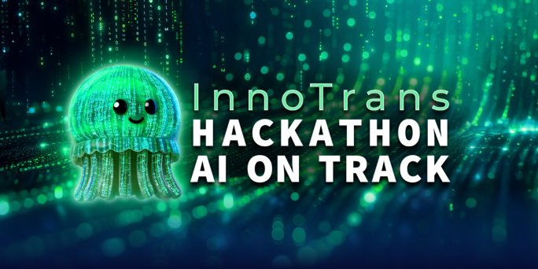

# InnoTrans 2026 Hackathon Problem Statement

**Scope:** Alstom InnoTrans 2026 Hackathon - Problem Statement, June 3, 2026

## Related Documentation

| Resource | Description |
| --- | --- |
| [Dataset schema](data/dataset_schema.md) | Dataset structure, organization, columns, types, and timestamp conventions, etc. |
| [Hackathon 2026 Berlin U-Bahn Dataset](dataset_schema.md) | Hackathon 2026 Berlin U-Bahn Dataset - Schema and Data Descriptions. |
| [Hackathon 2026 Questions - Training](hackathon_questions_training.md) | Hackathon Questions for Designing and Developing the Solution. |

## The Scenario

The Berlin U-Bahn network carries over 1.5 million passengers every day across 9 lines and 175 stations. Passenger numbers spike sharply when the city hosts a major event, a line goes down, or both happen at the same time.

Your challenge is to build a solution that *understands city context and explains passenger flows* under different conditions and stress.

## The Challenge

Build a conversational AI agent, preferably on an open-source framework and MCP infrastructure, that helps U-Bahn operators understand, anticipate, and respond to passenger flow disruptions in real time.

Your agent should be able to answer the questions operators actually ask:

- “U8 is suspended between Hermannplatz and Neukölln. Where will passengers reroute, and which stations are at risk of overcrowding in the next 20 minutes?”
- “There is a sold-out concert at Mercedes-Benz Arena tonight at 21:00. What does the flow look like at Hermannplatz, and what should we do at 23:15 when it ends?”
- “During InnoTrans 2026, we expect major passenger flow and bad weather. Show me the 3 stations most likely to exceed safe platform capacity during the first day of the event.”

Refer to the [Hackathon questions for Designing and Developing the Solution](hackathon_questions_training.md) file.

## The Data You Will Work With

All data is provided and ready to use; no setup is required. The training dataset spans **June 10, 2026, through September 21, 2026**.
[Hackathon dataset schema and instructions](dataset_schema.md)

| Dataset | Description | file(s) |
| --- | --- | --- |
| U-Bahn Network | Partial, but real, Berlin network topology: lines, stations, connections, interchange points and metros passing through. | `stations_with_ubahn.csv`, `berlin_ubahn_connections.csv`, and `berlin_ubahn_lines_used.csv` |
| Passenger Flow | Simulated entry and exit counts per station. | `flows.csv` |
| Events in Berlin | Football matches, concerts, public gatherings, shows, and conferences, including attendance. | `berlin_events_summer_2026.csv` |
| Disruption Scenarios | Simulated line suspensions due to maintenance; sections, stations, interstation segments, platform closures, and more, including dates, duration and affected stations and lines. | `closures.csv` |
| Weather Data | Real conditions known to affect ridership, including rain, extreme heat, and major weather events. | `weather_data.csv` |
| Energy Consumption | Simulated network-level energy usage patterns. | `energy_consumption.csv`|

## What We Provide

Every team starts with the same foundation:

- Datasets listed in the table above.
- Documentation and onboarding / during the hackathon support.
- Access to an LLM through the Lab-as-a-Service public endpoint.
- Access to AI experts from Alstom throughout the hackathon.

## What You Are Building

A conversational AI agent that an operator can query in natural language and receive a clear, grounded, and actionable answer.

The agent should reason through the situation step by step, explain its logic, and stay within the boundaries of what the data actually supports.

## Evaluation Criteria

Solutions will be judged by a panel of railway operators, AI engineers, and industry leaders using the following criteria.

First, you will be evaluated on the training questions, using [Answers on the Hackathon Questions for Designing and Developing the Solution](hackathon_answers_training.md) file.

Second, on September 25th, 2026, you will be provided with additinal data set, which spans **September 22, 2026, through September 30, 2026**, as well as a new set of questions for your final evaluation.

Finally, your solution will be evaluated against the new dataset and new questions during the final day of the Hackathon, September 25th, 2026.

The evalulation is split into 5 different categories, as defined in the [Alstom challange evaluation](ALSTOM_Challenge_Evaluation_Onepager.pdf).

### CHALLENGE FIT - Relevance

Does the agent answer what the operator actually needs to know?

- Each team will receive a list of questions that can be used to develop the solution.
- Nine typical questions will be posted for everyone at the beginning of the hackathon.
- Avoid hallucinations and irrelevant answers.
- **Score:** 0 (lowest) to 10 (highest). **Weight: = 0.1**

### TECHNICAL IMPLEMENTION and FUNCTIONALITY - Reliability

Are answers consistent, explainable, and grounded in the data?

- For each question, the real, grounded answer is known; results will be tested against the ground truth.
- During the evaluation, a new set of 5 questions will be posted for final testing.
- **Score:** 0 (lowest) to 20 (highest). **Weight: = 0.2**

### FEASIBILITY APPLICABILITY - Stress Testing

Could a real operator use the solution under pressure, without training?

- During testing, teams will receive an additional dataset spanning **September 22, 2026, through October 1, 2026**.
- **Score:** 0 (lowest) to 20 (highest). **Weight: = 0.2**

### INNOVATION / CREATIVITY

Does the solution tackle the problem in a novel way?

- A new solution based on either open source or a novel framework will receive a preferred score over an off-the-shelf, well-established tool.
- **Score:** 0 (lowest) to 25 (highest). **Weight: = 0.25**

### BUSINESS VALUE / BENEFIT - Impact

Could this be deployed in a real network?

- Demonstrate how your solution can be deployed in a real environment. Describe how the solution will be used and deployed.
- **Score:** 0 (lowest) to 20 (highest). **Weight: = 0.2**

## PITCH / PRESENTATION
- The top teams will present their solutions live in front of the full InnoTrans audience at the Alstom booth. This is not just a demo slot; it is an opportunity to put your solution in front of the people who can deploy it.
- **Score:** 0 (lowest) to 5 (highest). **Weight: = 0.05**